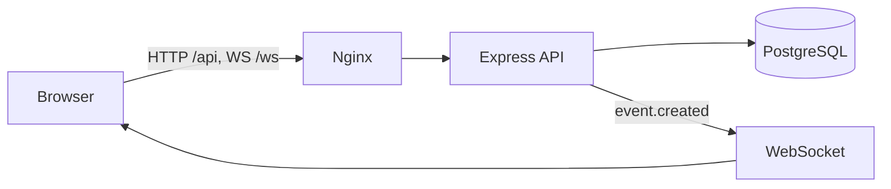

# Real-Time Event Dashboard

Single-page dashboard that ingests, filters, and visualizes live user activity logs. A Node.js/TypeScript API stores events in PostgreSQL and pushes them over WebSocket. The React UI polls every 5 seconds when the socket is down.

## One-command run

Requires [Docker Desktop](https://docs.docker.com/get-docker/) (or Docker Engine + Compose v2).

```bash
docker compose up --build
```

Then open **http://localhost:8080**.

That command builds the frontend and backend images, starts PostgreSQL, waits until the database is healthy, runs migrations, and serves the UI. Nginx proxies `/api` and `/ws` to the backend so the browser talks to a single origin.

Stop with `Ctrl+C`, or run `docker compose down`. Add `-v` to also delete stored events.

### Optional traffic

With the stack running, generate sample events from the host:

```bash
cd backend
cp .env.example .env
npm ci
API_URL=http://localhost:8080 npm run simulate
```

Or from inside the backend image (after a one-off install of `tsx`):

```bash
docker compose exec backend wget -qO- http://127.0.0.1:4000/health
```

## Architecture



| Service | Image / build | Role |
| --- | --- | --- |
| `db` | `postgres:16-alpine` | Event store |
| `backend` | `backend/Dockerfile` | REST + WebSocket API |
| `frontend` | `frontend/Dockerfile` | Vite build served by nginx |

## API

| Method | Path | Purpose |
| --- | --- | --- |
| `POST` | `/api/events` | Ingest `{ id, user_id, event_type, payload, timestamp }` |
| `GET` | `/api/events` | Paginated list (`page`, `limit`, `event_type`, `from`, `to`, `q`) |
| `GET` | `/api/events/analytics` | Counts by type and hour (`hours`, default 24) |
| `GET` | `/health` | Database probe |
| `WS` | `/ws` | Live `event.created` messages |

Rate limit: 30 requests per minute per IP on `/api/*`.

```bash
curl -X POST http://localhost:8080/api/events \
  -H "Content-Type: application/json" \
  -d "{\"id\":\"e1\",\"user_id\":\"u1\",\"event_type\":\"click\",\"payload\":{\"button\":\"buy\"},\"timestamp\":\"2026-09-28T08:00:00Z\"}"

curl "http://localhost:8080/api/events?page=1&limit=20"
curl "http://localhost:8080/api/events/analytics?hours=24"
```

Errors look like `{ "error": { "code": "VALIDATION_ERROR", "message": "...", "details": [] } }`.

## Local development (without Docker for the apps)

1. Start Postgres: `docker run -d --name events-db -p 5432:5432 -e POSTGRES_USER=events -e POSTGRES_PASSWORD=events -e POSTGRES_DB=events postgres:16-alpine`
2. Backend: `cd backend && cp .env.example .env && npm ci && npm run dev`
3. Frontend: `cd frontend && npm ci && npm run dev` (Vite on http://localhost:5173 proxies `/api` and `/ws`)

Tests: `npm test` in each app.

## Configuration

Defaults are baked into `docker-compose.yml`. Copy `.env.example` to `.env` only if you need to change ports, credentials, or the rate limit.

## Design notes

- **Repository injection** — HTTP handlers depend on `EventRepository`. Tests use an in-memory implementation; production uses PostgreSQL.
- **Realtime with fallback** — inserts broadcast over WebSocket; the UI polls every 5s while disconnected.
- **Single origin** — nginx terminates HTTP and upgrades WebSocket, so empty `VITE_API_URL` / `VITE_WS_URL` work in production.
- **Safe SQL** — list filters are parameterized. Payload search uses `ILIKE` rather than full-text search.
- **Startup migrations** — `CREATE TABLE IF NOT EXISTS` plus indexes, guarded by an advisory lock.
- **Rate limiting** — in-process, per IP. `TRUST_PROXY=1` so nginx forwards the client address. Multi-instance deployments would need Redis.

## Trade-offs

In-memory rate limits do not share state across replicas. Payload search is `ILIKE`, not Postgres full-text. Schema changes run at boot instead of a dedicated migrator.
